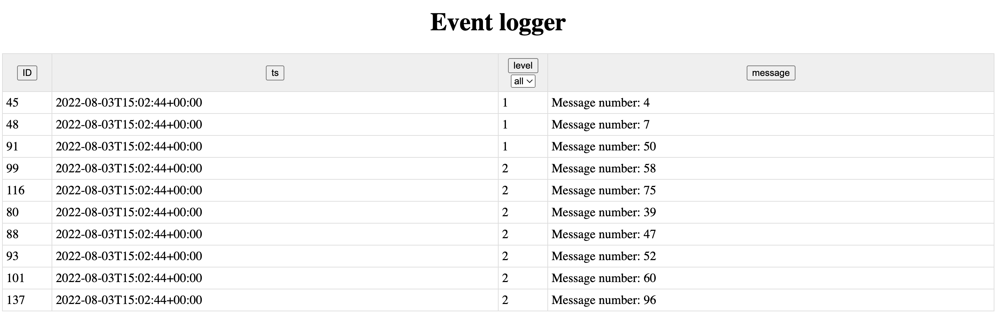

# Test task for Phishman
## Event-Log

React component to work with the event log and implement an API method to receive data from the server.

Events have the following structure:
- ts (Date) – event date,
- level (int) – event level (1 – debug, 2 –info, etc.),
- message (string) – message text.
  
###User interface requirements
React component should:
- Occupies all free space provided by the parent component.
- Provide the user with the following options:
sorting by field;
- filtering by the value of one of the fields;
- automatic loading of new data from the server every 5 seconds.

### Technical requirements
1. The minimum supported version of React is 16.12.0.
2. The minimum supported version of Redux is 4.0.5.
3. The main data array must be stored in the corresponding reducer.
4. There are no special requirements for the server side.

### Will be a plus
1. Implement the server part using the Symfony framework.
2. Organize the display of the list in paginated mode or as a virtual list.

## Screenshot
